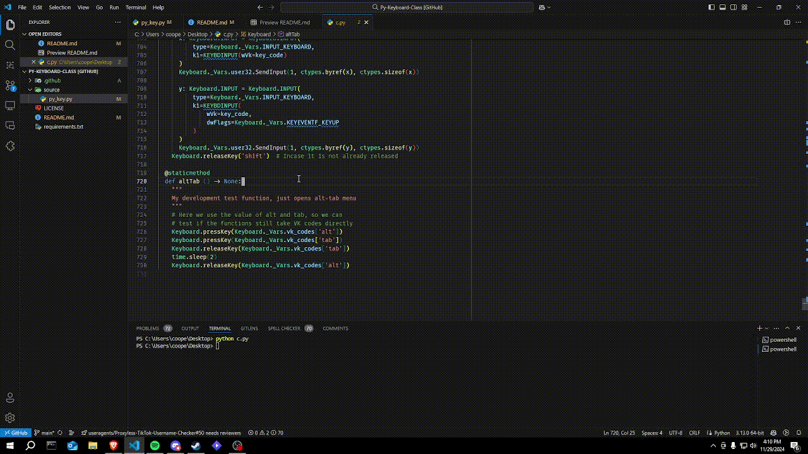

# Py-Keyboard-Class
A class used for handling inputs via virtual keyboard codes and win32 API. The Keyboard class can send inputs via functions like `scrollMouse`, `pressAndReleaseKey`, `keyboardWrite` and `pressAndReleaseMouse` it can also return keystrokes using the `GetKeystroke` wrapper which polls key presses. This project can send keyboard and mouse inputs on windows for anything.



[Source](https://github.com/itzCozi/Py-Keyboard-Class/blob/main/source/py_key.py)

## Usage

### getKeyState()
```
Returns the given key's current state

Args:
  key_code (str | int): The key to be checked for state

Returns:
  bool: 'False' if the key is not pressed and 'True' if it is
```

### locateCursor()
```
Returns a tuple of the current X & Y coordinates of the mouse

Returns:
  tuple[int, int]: The current X and Y coordinates EX: (350, 940)
```

### moveCursor()
```
Moves the cursor to a specific coordinate on the screen.

Args:
  x (int): The x-coordinate to be sent to user32
  y (int): The y-coordinate to be sent to user32
```

### scrollMouse()
```
Scrolls mouse up, down, right and left by a certain amount

Args:
  direction (str): The way to scroll, valid inputs: (
    up, down, right, left
  )
  amount (int): How much to scroll has to be at least 1
  dx (int, optional): The mouse's position on the x-axis
  dy (int, optional): The mouse's position on the y-axis
```

### pressMouse()
```
Presses a mouse button

Args:
  mouse_button (str | int): The button to press accepted: (
    left_mouse,
    right_mouse,
    middle_mouse,
    mouse_button1,
    mouse_button
  )
```

### releaseMouse()
```
Releases a mouse button

Args:
  mouse_button (str | int): The button to press accepted: (
    left_mouse,
    right_mouse,
    middle_mouse,
    mouse_button1,
    mouse_button
  )
```

### pressKey()
```
Presses a keyboard key

Args:
  key_code (str | int): All keys in vk_codes dict are valid
```

### releaseKey()
```
Releases a keyboard key

Args:
  key_code (str | int): All keys in vk_codes dict are valid
```

### pressAndReleaseKey()
```
Presses and releases a keyboard key sequentially

Args:
  key_code (str | int): All keys in vk_codes dict are valid
```

### pressAndReleaseMouse()
```
Presses and releases a mouse button sequentially

Args:
  mouse_button (str | int): The button to press accepted: (
    left_mouse,
    right_mouse,
    middle_mouse,
    mouse_button1,
    mouse_button
  )
```

### keyboardWrite()
```
Writes by sending virtual inputs

Args:
  source_str (str): The string to be inputted on the keyboard, all
  keys in the 'Alphanumerical' section of vk_codes dict are valid
```

## Code Pics
  
Keyboard class doc-string

  
Main Keyboard input class (before static type hinting was added)
